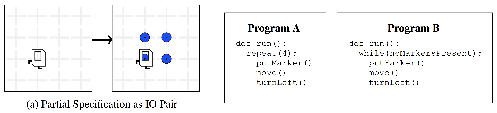

# Leveraging Grammar and Reinforcement Learning for Neural Program Synthesis

TensorFlow implementation of [Leveraging Grammar and Reinforcement Learning for Neural Program Synthesis](https://openreview.net/forum?id=H1Xw62kRZ).

## Requirements

- Python 2.7+
- [tqdm](https://github.com/tqdm/tqdm)
- [karel](https://github.com/carpedm20/karel)
- [TensorFlow](https://www.tensorflow.org/) 1.4.1

## Usage

Prepare with:

    $ pip install -r requirements.txt

To generate datasets:

    $ python dataset.py --data_dir=data --max_depth=5

To train a model:

    $ python main.py
    $ tensorboard --logdir=logs --host=0.0.0.0

## Results

Currently, only maximum likelihood optimization is implemented. Expected correctness and RL is in progress.

(in progress)

## References

- [Karel dataset](https://github.com/carpedm20/karel)
- [Neural Program Meta-Induction](https://arxiv.org/abs/1710.04157)

## Author

Taehoon Kim / [@carpedm20](http://carpedm20.github.io/)
